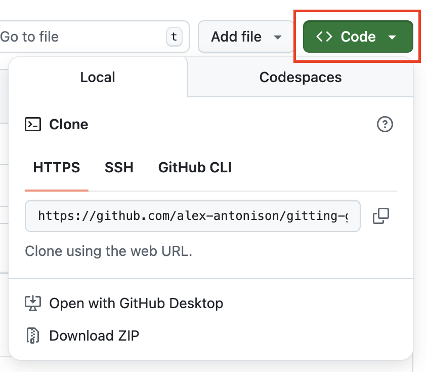

# **Module 2 - Basic Git Operations**

* Getting started working with Repositories
* Ignoring Files
* Staging and Committing Changes
* When to Commit
* Undoing Changes
* Removing Files

---
layout: two-cols
---

# **Getting started working with Repositories**
<div class="text-2xl">

1. [Creating a repository](https://docs.github.com/en/repositories/creating-and-managing-repositories/quickstart-for-repositories)
2. [Forking a repository](https://docs.github.com/en/pull-requests/collaborating-with-pull-requests/working-with-forks/fork-a-repo#forking-a-repository)

[github.com/alex-antonison/gitting-good-at-github](https://github.com/alex-antonison/gitting-good-at-github)

Once a repository has been created or forked, you can then clone a repository with
</div>
```bash
git clone {repository link}
```

::right::



---

# **Ignoring Files**

* A `.gitignore` file is used to ignore files that you do not want to manage in source control. Some examples are:
  * Files containing secrets (passwords, API keys, etc.)
  * Locally installed package files like `.venv/`
  * Large data files (aka 2 GB csv files)

---

# **Ignoring Files (Activity)**

1. Create a directory `new_folder`
2. Create a file `new_file.txt` in the `new_folder` directory.
3. Add `new_folder/` to the `.gitignore` file in the root project.
4. To the root project, add a file called `new_file.csv`
5. Add `*.csv` to the `.gitignore` file.

---

# **Staging and Committing Changes**
<div class="text-2xl">

* You can either add all files with `git add -A` or `git add path/to/filename`
  * Tools like GitHub Desktop and VS Code's Source Control Panel are helpful to see all files
* Once a file is staged, you can then `commit` the changes with
  * `git commit -m"{insert message here}"`
* To commit all tracked files that have been modified, you can use the `-a` argument:
  * `git commit -am"{insert message here}"`
</div>

---

# **Committing Changes (Activity)**
<div class="text-2xl">

1. Make changes to the `existing_file.txt`
2. Create a file in `exercises` directory called `new_file.txt` and add text to it
3. `git commit -am "{insert your descriptive message here}"`
4. `git status`
5. `git add exercises/new_file.txt`
6. `git status`
7. `git commit -m "{insert your descriptive message here}"`
8. Check **Commit History.** You can use `git log` but GitHub Desktop or VS Code is easier
</div>
---

# **When to Commit?**

* When do you commit?
  * Committing too often leads to noisy commits
  * Committing too infrequently makes it hard to find changes
* _The best time to commit is when you have completed a "thought"_
  * This could be when you finish a function, update some business logic, etc.

---

# **Undoing Changes**
<div class="text-2xl">

* `git reset HEAD~1`
  * This simply undoes the last commit with files intact
* `git checkout origin/main path/to/filename`
  * This will reset the file to what is in the main branch
</div>

---

# **Undoing Changes (Activity)**

1. To undo your last commit, run `git reset HEAD~1`

<div class="text-3xl">
You can explore other ways of changing history, but suggest using GitHub Desktop.

* git commit --amend
* git revert
</div>

---

# **Removing Files**
<div class="text-2xl">

* In the event a file gets added that you want to remove, you can use the\
`git rm` command:
* If you want to completely remove the file, you can do:
  * `git rm path/to/file`
* If you want to just stop tracking it in source control you can do:
  * `git rm --cached path/to/filename`
  * Add the file to your `.gitignore`
* If you want to remove an entire directory:
  * `git rm -r path/to/directory`
* Last, you need to commit the removal change using `git commit`
</div>

---

# **Removing Files (Activity)**

1. Remove `new_folder` from `.gitignore`
2. Stage the `new_folder/new_file.txt` file.
3. Commit the `new_folder/new_file.txt` file.
4. Remove the whole folder `git rm -r new_folder/`
5. Commit the removal `git commit -m"Remove new_folder"`

---

# **Removing Files (Activity Part 2)**

1. Add a `.secrets` folder to the project.
2. Add a `.env` file to the `.secrets` directory.
3. Add and commit the `.env` file.
4. Add `.secrets/` to the `.gitignore` file.
5. Remove the `.env` file from git cache
   1. `git rm --cache .secrets/.env`
