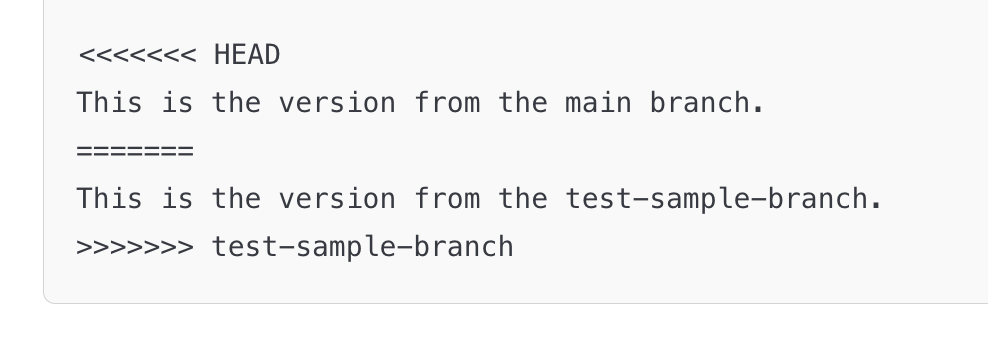

# **Module 3 - Branching and Merging**

* What are Branches
* Working with Branches
* Merging Branches
* Merge Conflicts

---

# **What are Branches?**

* A branch lets you work on changes separately from the main code.
  * For individual projects, working in `main` is "okay"
  * It is a good habit to always work in branches
  * For team based projects, always need to work in branches

---

# **Working with Branches**

* Create a branch and then checkout that branch:
  * Create a branch `git branch {insert-descriptive-branch-name}`
  * To checkout a `git checkout {insert-descriptive-branch-name}`
* Create and checkout a branch:
  * `git checkout -b {insert-descriptive-branch-name}`
* To delete a branch
  * `git checkout main`
  * `git branch -D {insert-descriptive-branch-name}`

---

# **Working with Branches (Activity)**

1. Create a branch `git checkout -b my-new-branch`
2. Delete the branch:
   1. `git checkout main`
   2. `git branch -D my-new-branch`

---

# **Merging Branches**

* To merge a branch locally, you do `git merge {insert-branch-name}`
* It is common to need to merge `main` into current branch because:
  * In your Pull Request, you have merge conflicts you need to address
  * Code has been merged into main that you need for your work
* To merge main into your current branch
  * `git checkout main` (swap to main)
  * `git pull` (update main branch)
  * `git checkout {insert-branch-name}` (swap back to your branch)
  * `git merge main` (merge main into your branch)

---

# **Merging Branches (Activity)**

1. Create a branch `git branch add-feature`
2. Create a file `branch_test_file.txt` and add it
   1. `git add branch_test_file.txt`
   2. `git commit -m "Add branch test file"`
3. `git checkout add-feature` (Swap to add-feature branch)
4. Merge main into `add-feature` branch
   1. `git merge main`

---
layout: two-cols
---

# **Merge Conflicts**

* Occurs when changes in two branches **affect the same part of a file** and Git can't automatically decide which change to keep, requiring manual resolution.

::right::

  

---

# **Merge Conflict (Activity)**

1. `git checkout main` (swap back to main)
2. Make a change to the first line in `exercises/existing_file.txt`
3. `git commit -am"Commit message for existing_file.txt"`
4. `git checkout add-feature` (swap back to add-feature)
5. Make a different change to the first line in `exercises/existing_file.txt`
6. `git commit -am"Commit message for existing_file.txt"`
7. Run `git merge main`
8. You can use the built in VS Code or GitHub Desktop to resolve the conflict.

