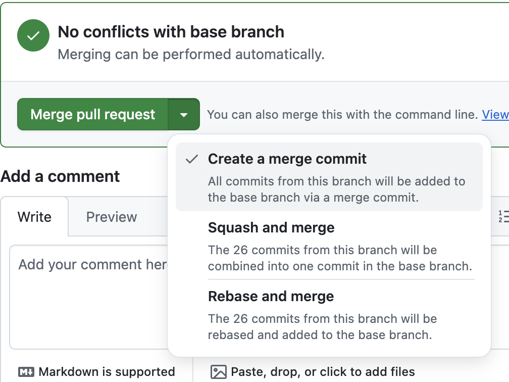

# **Module 4 - Collaboration on GitHub**

* Branching Strategies
* Creating Pull Requests
* Reviewing Pull Requests
* Merge Types

---

# **Branching Strategies**

* **Git Flow.** A branching model that uses feature, develop, release, and hotfix branches to manage complex release cycles with multiple environments.
* **Trunk-Based Development.** A streamlined approach where developers work in short-lived branches to enable continuous integration and rapid delivery.

---

# **Creating Pull Requests**

* [To create a successful Pull Request](https://docs.github.com/en/pull-requests/collaborating-with-pull-requests/proposing-changes-to-your-work-with-pull-requests/creating-a-pull-request), it should convey the following:
  * **Context.** Why are these changes being made to the code base?
  * **Description.** You should include a summary of the changes being made.
  * **Tests + Documentation.** You should include any required tests or documentation.
  * **Pull Request Template.** Streamlines organizing Pull Request descriptions.
  * **Draft Pull Request.** Create a "draft" pull request indicating a PR is still in progress.

---

# **Reviewing Pull Requests**

* [When reviewing a Pull Request](https://docs.github.com/en/pull-requests/collaborating-with-pull-requests/reviewing-changes-in-pull-requests/reviewing-proposed-changes-in-a-pull-request), you can do a couple of things:
  * **In-line Code Comments.** Making in-line comments helps direct someone directly to a bit of code.
  * **Suggested Changes.** Add a suggested change to help improve a Pull Request.
  * **Pull Request Comments.** These can be helpful if there is a high level comment about a Pull Request.

---
layout: two-cols
---

# **Merge Types**

* Merge
* Squash and merge (squerge)
* Rebase and merge

::right::

  

